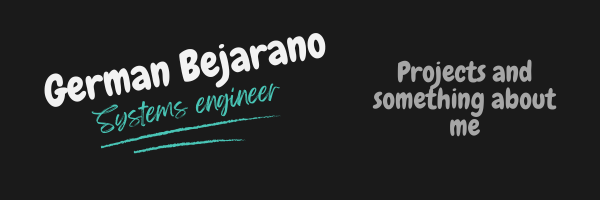

# 👋 Hi, I'm German Bejarano!

Welcome to my GitHub space! I'm a developer who creates technological solutions that positively impact people's lives. My focus is on web and mobile development, using a variety of technologies to build robust and scalable applications.

## 🚀 Technologies & Tools

## &#x1f4c8; GitHub Stats

  

  

